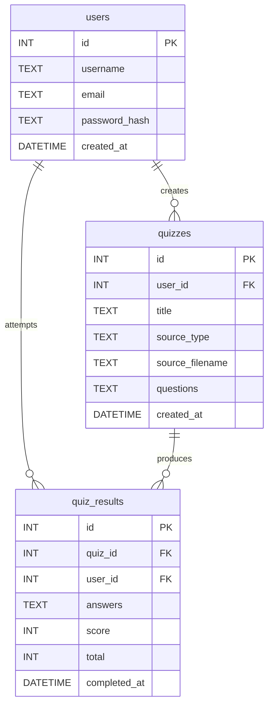

# QUIZ GENERATOR

**CS50 Final Project**  
**Author:** Gislaine Denigres  
**GitHub:** gililo  
**edX:** GislaineLilo  
**Location:** São Paulo, Brazil  
**Date:** 03/11/2026  

#### Video Demo: [Click here](https://www.youtube.com/watch?v=Hhw4kzhx4SQ)

# Description

This project was designed to solve a real and practical problem. I did not want to spend hours or days developing something that would not be useful in my daily life.

The idea for this project came during a moment at home. My son arrived from school and told me he had a Biology test the next day. As usual, he asked me to take his study notes and ask him questions so he could practice and ensure he had learned the material well enough for the test.

At that moment I realized the problem: study notes already exist, but transforming them into effective quiz questions requires time and often some knowledge of the subject.

That is when the idea for **Quiz Generator** emerged.

The goal of the project is to transform study materials into quizzes automatically. Instead of manually creating questions, the application uses artificial intelligence to generate questions and answers based on uploaded study content. This allows students to test their knowledge quickly and helps parents or teachers save time when preparing practice questions.

The application allows users to upload images of handwritten notes or PDF documents. The system extracts the text from these materials, processes it using AI models, and generates a quiz. After completing the quiz, the application displays the results and stores the attempt history.

---

# Project Goals

The main goals of the project were:

- Create a practical tool that solves a real problem
- Allow users to generate quizzes from study materials
- Use artificial intelligence to automate question generation
- Provide a simple and intuitive interface
- Keep the entire project built using **free tools and services**

---

# Technology Choices

One important decision from the beginning was that all tools used in the project should be free or have generous free tiers.

## Database

For the database, I decided to continue using the same technology used during the course: **SQLite**. It is lightweight, easy to configure, and perfect for a project of this scale.

## Backend

The backend was developed using **Python with Flask**. Flask provides a simple and flexible framework for building APIs and integrates easily with Python libraries used throughout the project.

## Frontend

The frontend was built using **React and CSS**.

React was chosen because it allows:

- A dynamic and responsive user interface
- Clear separation between frontend and backend
- Efficient state management through the Context API
- Reusable UI components

## Artificial Intelligence

For the AI component, I chose **LLAMA models**, accessed through the Groq API. The reason for this choice was the availability of image-reading capabilities and a generous free usage tier.

Two different models were used:

- **meta-llama/llama-4-scout-17b-16e-instruct**
Used to extract text from uploaded images.

- **llama-3.3-70b-versatile**
Used to generate quiz questions and answers based on the extracted content.

---

# Additional Feature: PDF Support

While developing the application, I realized it would also be useful to support PDF documents in addition to images.

To implement this feature, I used the **PyMuPDF (fitz)** library, which allows the application to open PDF files, extract the text from each page, and process it the same way as image-based notes.

---

# Database Structure

The database is created in `database.py` and contains three main tables:

- users
- quizzes
- quiz_results


---

# Authentication System

Authentication logic is implemented in `auth.py`.

The system uses:

- **bcrypt** for password hashing
- **JWT (JSON Web Tokens)** for authentication

When a user submits the login form, the frontend sends a **POST** request to `/login` containing the username or email and the password.

The backend searches for a user that matches the provided email or username and verifies the password using `bcrypt.checkpw()`. The original password is never stored in the database.

If authentication fails, the API returns an error indicating invalid credentials.

If authentication succeeds, the backend generates a **JWT token valid for 7 days**, signed with the application's `SECRET_KEY`. The token and basic user information (`id`, `username`, and `email`) are returned to the frontend.

The frontend stores this token and sends it in the **Authorization header** for protected requests.

Additional authentication routes include:

- `/register` — register a new user
- `/me` — return the currently authenticated user's information


---

# Quiz API

Quiz-related routes are implemented in `quiz.py`.

Available routes include:

- `/generate` — generate a quiz from uploaded content
- `/submit` — submit quiz answers and calculate results
- `/history` — list all quizzes for the logged-in user
- `/stats` — show statistics such as quizzes taken and average score
- `/<quiz_id>` (**GET**) — retrieve a specific quiz
- `/<quiz_id>` (**POST**) — delete a quiz and its results

---

# Text Extraction

The application includes two main functions for extracting text from study materials.

### `extract_text_from_pdf`

Uses **PyMuPDF (`fitz`)** to open PDF files and extract text from each page.

### `extract_text_from_image`

Uses the **LLAMA model via the Groq API** (`meta-llama/llama-4-scout-17b-16e-instruct`) to extract text from images.

To avoid exceeding API limits, requests are limited to **2000 tokens**.

---

# Frontend Structure

The frontend is organized into three main folders.

## `/context`

Contains `AuthContext.js`, which manages global authentication state using the **React Context API**.

It stores the JWT token and logged-in user information so that they can be accessed by any component in the application without passing props through multiple layers.

---

## `/pages`

Each screen of the application is implemented as a separate file.

### `AuthPage.js`

Login and registration screen. Communicates with the Flask `/login` and `/register` endpoints.

### `Dashboard.js`

Main screen after login where users can see quiz history, generate new quizzes, retake quizzes, or delete them.

### `GenerateQuiz.js`

Allows users to upload images or PDFs and send them to the backend for AI processing.

### `TakeQuiz.js`

Displays quiz questions interactively and allows users to submit answers.

### `Results.js`

Displays quiz results, including the final score and highlighting correct and incorrect answers. The result is also saved in the database.

---

## `/styles`

Contains a single `styles.css` file responsible for the styling of the entire application.

---

# Installation

To run this project locally, follow the steps below.

## Clone the repository

```bash
git clone https://github.com/gililo/quiz-generator.git
cd quiz-generator
```

## Navigate to the backend directory

```bash
cd backend
```

## Create and activate a virtual environment

```bash
python -m venv venv
```

## Activate the virtual environment

### macOS / Linux:

```bash
source venv/bin/activate
```

### Windows:

```bash
venv\Scripts\activate
```

## Install the dependencies

```bash
pip install -r requirements.txt
```

## Run the backend server

```bash
flask run
```

## Open a new terminal and navigate to the frontend directory

```bash
cd frontend
```

## Install dependencies

```bash
npm install
```

## Start the React development server

```bash
npm start
```

## The frontend will run on:

```bash
http://localhost:3000
```

---

# Features

- User authentication with JWT
- Secure password storage using bcrypt
- Upload handwritten notes as images
- Upload PDF study materials
- AI-powered text extraction from images
- Automatic quiz generation using LLMs
- Interactive quiz interface
- Quiz history tracking
- Performance statistics for each user

---

# Project Structure

```
quiz-generator/
│
├── backend/                        # Python / Flask API
│   ├── uploads/
│   ├── .env
│   ├── .gitignore
│   ├── app.py                     
│   ├── auth.py                    
│   ├── database.py                
│   ├── quiz.py                    
│   ├── quiz_app.db                
│   └── requirements.txt           
│
└── frontend/                       # React application
    ├── public/
    ├── src/
    │   ├── context/
    │   ├── pages/                  # App pages (Home, Quiz, History, etc.)
    │   ├── styles/                 # CSS / styling files
    │   ├── App.js                  
    │   └── index.js                # React entry point
    ├── .gitignore
    ├── package.json
    └── package-lock.json
```

# Conclusion

The Quiz Generator demonstrates how artificial intelligence can transform study materials into interactive quizzes automatically.

By combining image processing, PDF text extraction, AI-powered question generation, and a modern web interface, the project provides a practical solution for students who want to test their knowledge more effectively.

The project also reflects the core concepts learned throughout CS50, including database design, authentication systems, API development, and frontend-backend integration.

